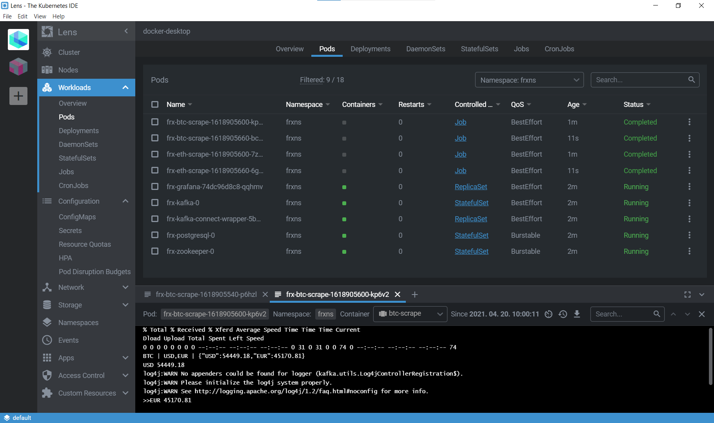
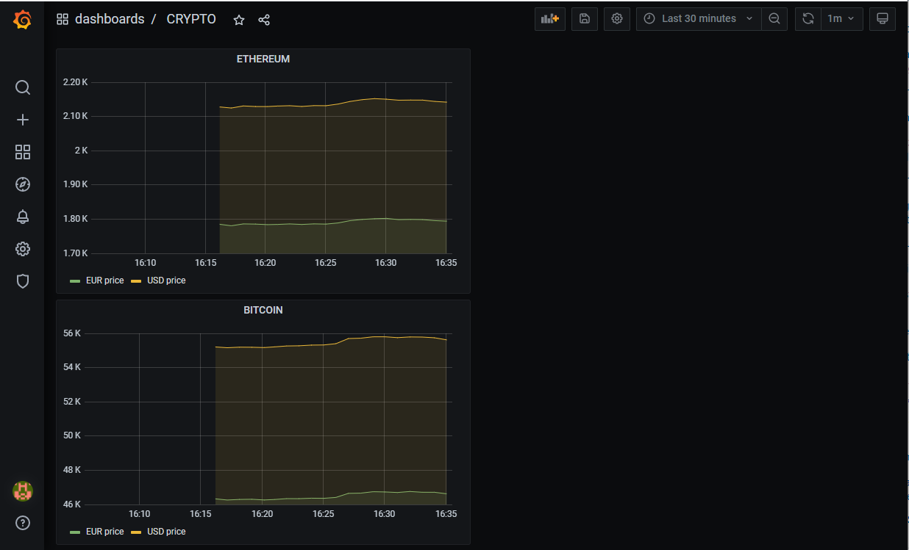

Development documentation
=========================
When I try to learn new technologies (at least new for me), then I usually try to find a concrete 
use case or example. It is easier for me, learning by examples. Not everybody likes that,
but this is my way.

So I chose an interesting topic and then I implemented it with microservices.

## Design and data flow
How does it look like? Crypto currencies are popular nowdays and everyone (included me)
is interested about prices. 

Design is simple: getting data and sending to Kafka. Consumers can read the prices and 
implement any logic. Appart from that I would like to persist prices into RDB. After that these prices
should be visible somehow for end users. I chose Grafana for that. 

## Helm and Kubernetes

I don't need to talk about [k8s](https://kubernetes.io/), because it became a standard in cloud based environment. 

[Helm](https://helm.sh) is a widely used package manager and installation tool for k8s. 
Unfortunately Helm's dev team is really burocratic. Everyone would like to use some 
features, but they are adding it really slow. My case could be fully supported with 
[this](https://github.com/helm/helm/pull/6876) change, but they refused it. It's okay
if they don't like it, but no alternatives were presented. 

I could switch to [Terraform](https://www.terraform.io/), but no experiences yet. 
I should learn about it more.

At this moment I stayed with Helm, but it is the reason why there are some hard coded
configuration, which is not elegant. It can be resolved some tricky way, but it's 
out of scope now.

[Lens](https://k8slens.dev/) is my favorite tool for DevOps development, I would recommend it.

## Crypto scraper
This is just a simple bash script: [crypto-scrape.sh](../script/crypto-scrape.sh) 

There are various opportunities if you would like to collect crypto prices. 
I read [ssaurel article]( https://ssaurel.medium.com/create-a-bitcoin-price-index-watcher-in-html5-f441b1e05cd1) about it and there are
lots of pages with crypto price data. For example: [coindesk](https://api.coindesk.com/v1/bpi/currentprice.json) with [coindesk-api](https://www.coindesk.com/coindesk-api) 
or [coinapi](https://docs.coinapi.io/) is a powerful alternative. If you would like to build real data collection application, 
then you should buy an account for real time data.
Finally I chose [CryptoCompare](https://min-api.cryptocompare.com/) REST API. It is clear, simple,
easy to use. Everything what you need.

This script is configured as a cron job. I used this [helm cron job template](https://github.com/bambash/helm-cronjobs),
which is fullfill the requirements. Default is one query for every minute. 

## Kafka
Bitnami's [Kafka](https://github.com/bitnami/charts/tree/master/bitnami/kafka) is used. 

## Kafka Connect 
[Kafka Connect](https://docs.confluent.io/platform/current/connect/index.html "Confluent's Homepage")
is a tool for scalably and reliably streaming data between Apache Kafka® and other data systems.
A small microservice was created, this has been used now: [kafka-connect-wrapper](https://github.com/lsmhun/kafka-connect-wrapper) 

I had to create a [helm chart repository](https://github.com/lsmhun/lsmhun-helm-charts/tree/gh-pages) and after that I was able to register it into [artifacthub.io](https://artifacthub.io/packages/helm/lsmhun/kafka-connect-wrapper), like a regular helm repo source.
 
## PostgreSQL database
Bitnami's [PostgreSQL helm chart](https://github.com/bitnami/charts/tree/master/bitnami/postgresql) is used. 

## Grafana
[Grafana](https://grafana.com/) is a popular technology used to compose observability dashboards. Lots of DevOps engineer use it for [Prometheus](https://prometheus.io/) and cluster data monitoring.
In our case it's just a powerful dashboard creation tool.

Bitnami's [Grafana helm chart](https://github.com/bitnami/charts/tree/master/bitnami/grafana) was chosen. 

Grafana has a dashboard description JSON format, so if you prepared a dashboard, it can be
exported. Then it can be imported or used as a [preconfigured dashboard](https://grafana.com/docs/grafana/latest/datasources/google-cloud-monitoring/preconfig-cloud-monitoring-dashboards/)

There was just some tricks:
- exported dashboard should be extended with datasource name (by default datasource name is not there)
- datasources in Grafana is like INI files. It has to be a k8s secret, which means base64 
encoding should be configured in helm
- `dashboardsProvider.enabled` should be enabled if you need `dashboardsConfigMaps`, otherwise
it won't read the pre-defined dashboards

## Screenshots
